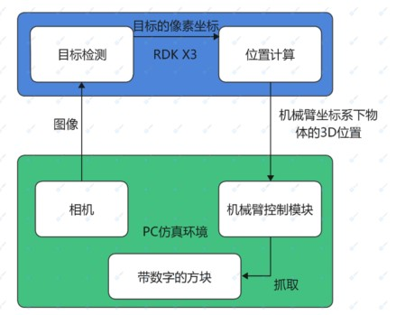
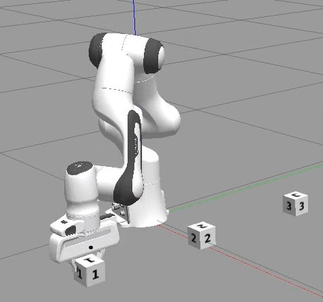

English| [简体中文](./README_cn.md)

# sim_arm_target_location

# Introduction EN

This package receives requests for selecting block numbers from users, detects targets with yolov5, calculates the three-dimensional coordinates of objects when the distance on the Z-axis is determined, and requests the simulation robotic arm control node to pick up the object.



# Instructions for Use

## Preparation

1. PC with Ubuntu 22.04 operating system (for robotic arm simulation), and in the same network segment as RDK X3
2. Compile the [robotic arm simulation package](https://github.com/wunuo1/sim_arm_pickup_demo) on the PC and ensure it can run normally.

## Package Installation

**1. Install the package**

After starting the robot, connect to the robot through SSH or VNC on the terminal, click the "One-Click Deployment" button at the top right of this page, copy and run the following command on the RDK system to complete the installation of related Nodes.

```bash
sudo apt update
sudo apt install -y tros-sim-arm-target-location
```

**2. Run the package**

On the PC side:
```shell
# Start the robotic arm simulation environment
source ~/moveit2_ws/install/setup.bash
ros2 launch panda_ros2_moveit2 panda.launch.py

# Open a new terminal, start the robotic arm control node
source ~/moveit2_ws/install/setup.bash
ros2 launch sim_arm_pickup_control arm_pickup_service.launch.py
```


On RDK X3:
```shell
# Start object detection and position calculation function
source /opt/tros/local_setup.bash
cp -r /opt/tros/lib/sim_arm_target_location/config/ .
ros2 launch sim_arm_target_location sim_arm_target_location.launch.py

# Open a new terminal, send a pick-up request (the number of the block is 1-3, using 1 as an example here)
``````bash
source /opt/tros/local_setup.bash
ros2 service call /sim_arm_target_location/choose_cube sim_arm_location_msg/srv/ChooseCube "{num: 1}"
```


# Interface Description

## Services

### 

| Name                       | Type                                                | Description                                         |
| -------------------------- | --------------------------------------------------- | --------------------------------------------------- |
| /sim_arm_target_location/choose_cube | sim_arm_location_msg::srv::ChooseCube | Allows the user to choose the number of the cube to pick. Request: uint16 num; Response: bool success |
| /sim_arm_target_location/target_location | sim_arm_location_msg::srv::TargetLocation | Provides the three-dimensional coordinates of the target. Request: float32 x, float32 y, float32 z; Response: bool success |

## Parameters

| Parameter Name       | Type           | Description                                                                |
| -------------------- | -------------- | -------------------------------------------------------------------------- |
| sub_img_topic        | string         | The topic name for receiving images, configure based on the actual topic received, default is /hbmem_img |
| is_shared_mem_sub    | bool           | Whether to receive images using shared memory, configure as needed, default is True |
| config_file          | string         | Path to the configuration file, configure based on recognition situation, default is config/number_cube.json |
```