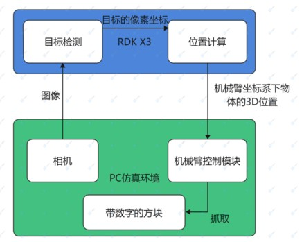
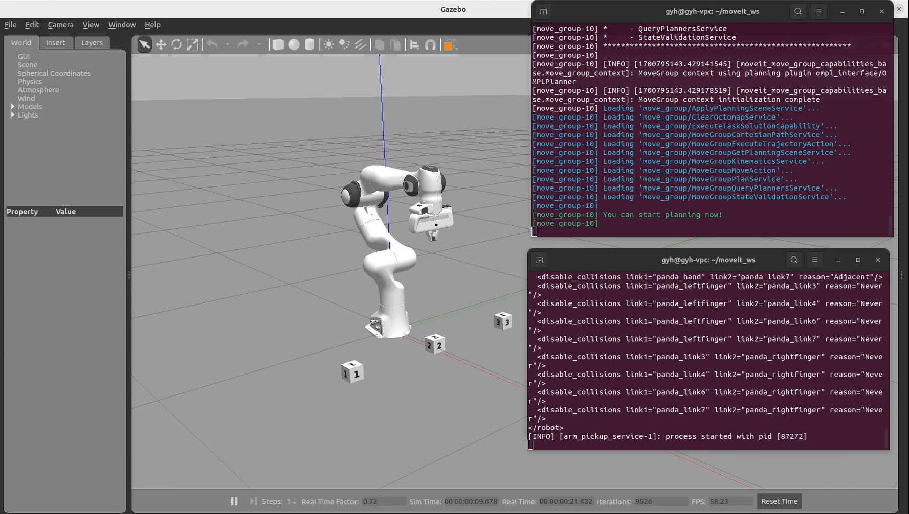
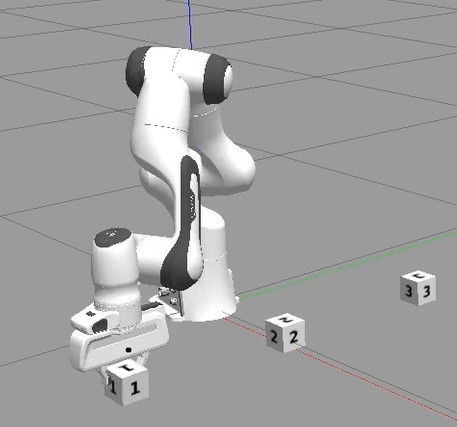

简体中文 | [English](./README.md)

# sim_arm_target_location

# 功能介绍

该功能包接收用户选择方块数字的请求，通过yolov5检测目标，在Z轴距离确定的情况下解算出物体的三维坐标，并请求仿真机械臂控制节点夹取物体。



# 使用方法

## 准备工作

1. Ubuntu22.04操作系统的PC（用于机械臂仿真），并且与RDK X3在同一网段下
2. 在PC上完成[机械臂仿真功能包](https://github.com/wunuo1/sim_arm_pickup_demo)的编译，并且能够正常运行。

## 安装功能包

**1.安装功能包**

启动机器人后，通过终端SSH或者VNC连接机器人，点击本页面右上方的“一键部署”按钮，复制如下命令在RDK的系统上运行，完成相关Node的安装。

```bash
sudo apt update
sudo apt install -y tros-sim-arm-target-location
```

**2.运行功能**

PC端：
```shell
#启动机械臂仿真环境
source ~/moveit2_ws/install/setup.bash
ros2 launch panda_ros2_moveit2 panda.launch.py

#打开新的终端，启动机械臂控制节点
source ~/moveit2_ws/install/setup.bash
ros2 launch sim_arm_pickup_control arm_pickup_service.launch.py
```


RDK X3：
```shell
# 启动物体检测与位置解算功能
source /opt/tros/local_setup.bash
cp -r /opt/tros/lib/sim_arm_target_location/config/ .
ros2 launch sim_arm_target_location sim_arm_target_location.launch.py

# 打开新的终端，发送夹取请求（方块的数字为1-3，此处以1为例）
source /opt/tros/local_setup.bash
ros2 service call /sim_arm_target_location/choose_cube sim_arm_location_msg/srv/ChooseCube "{num: 1}"
```


# 接口说明

## 服务

### 

|名称  | 类型                                    | 说明            |
|------| -------------------------------------------| --------------------------------|
|/sim_arm_target_location/choose_cube |sim_arm_location_msg::srv::ChooseCube      | 用于用户选择想要拾取的方块号码。请求：uint16 num ；回复：bool success|
|/sim_arm_target_location/target_location |sim_arm_location_msg::srv::TargetLocation  | 目标的三维坐标。请求：float32 x, float32 y, float32 z  ；回复：bool success      |


## 参数

| 参数名                | 类型        | 说明                                              |
| --------------------- | ----------- | ------------------------------------------------ |
| sub_img_topic       | string |     接收的图片话题名称，请根据实际接收到的话题名称配置，默认值为/hbmem_img |
| is_shared_mem_sub   | bool | 接收图片是否使用共享内存，请根据实际情况配置，默认值为True |
| config_file | string | 配置文件读取路径，请根据识别情况配置，默认值为config/number_cube.json |
